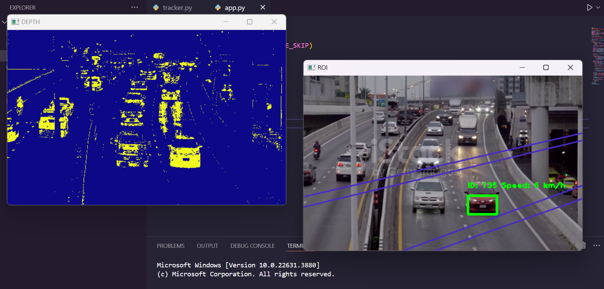

## Vehicles speed estimation with depth estimation

This project focusses on tracking and Speed Estimation of vehicles passing by a road.

- To perform vehicles detection and tracking, background subtraction which is traditional approach is used to detect moving vehicles.

- The speed of a vehicle is estimated when a tracked vehicle covers a segment of road.

Region of Interest (ROI) takes a smaller portion of the original video. On this ROI, Image subtraction 
is performed to detect a moving vehicle. (Image Subtraction helps find the difference between two 
frames). Masking is performed to make the moving vehicles appear white and the rest of the image 
black

Based on the area threshold of number of pixels, the contours are detected. The threshold is used to 
avoid detecting contours of smaller moving objects that are not vehicles. The object is tracked based 
on the distance between two contours between frames. An ID is assigned to each contour.